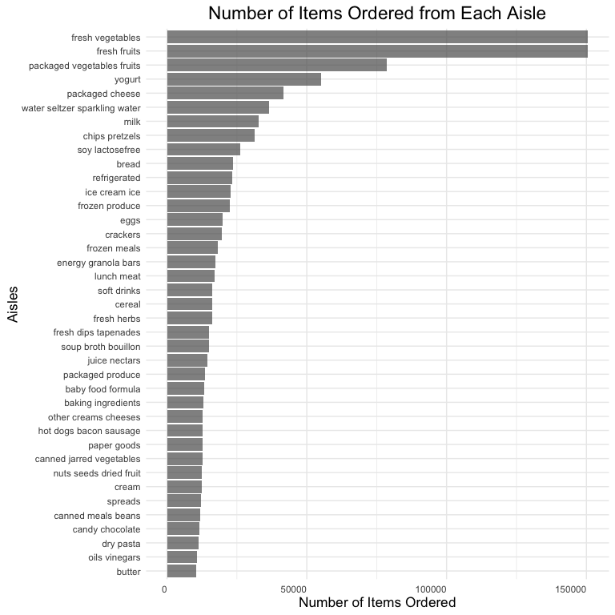
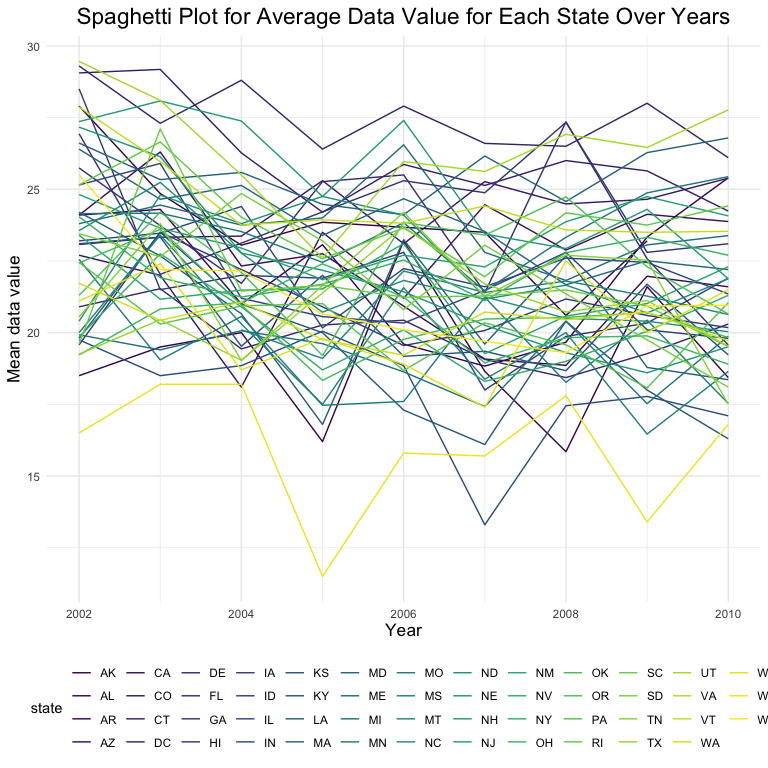
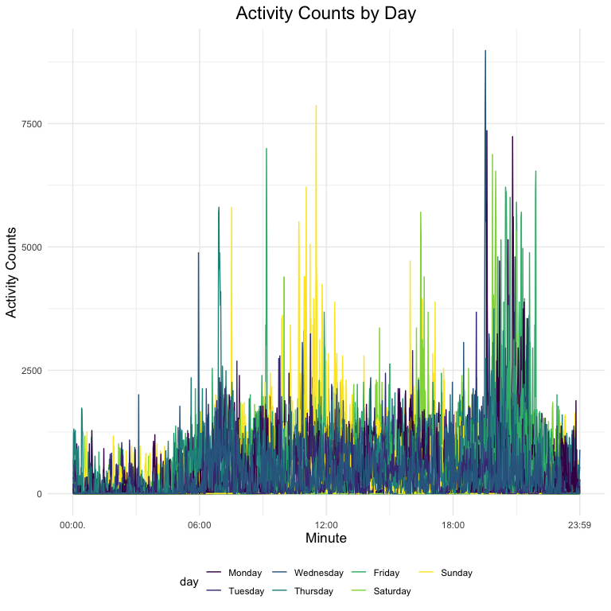

p8105\_hw3\_yw3774
================
Yida Wang
10/16/2021

## Problem 1

Load dataset instacart

``` r
data("instacart")
```

-   description of instacart There are 1384617 observations and 15
    variables in this dataset. Each row represents an order of the
    product and the variables are order\_id, product\_id,
    add\_to\_cart\_order, reordered, user\_id, eval\_set, order\_number,
    order\_dow, order\_hour\_of\_day, days\_since\_prior\_order,
    product\_name, aisle\_id, department\_id, aisle, department. It has
    21 departments and 134 aisles in total.

### Aisle that sold most items

``` r
aisle_freq = instacart %>% 
  group_by(aisle) %>% 
  summarize(
    n_obs = n()
  )
most_aisle = aisle_freq %>%
  slice_max(n_obs)
most_aisle %>%
knitr::kable()
```

| aisle            | n\_obs |
|:-----------------|-------:|
| fresh vegetables | 150609 |

There are 134 aisles and the most items are ordered from fresh
vegetables, which sold 150609 products.

### Plot number of product sold in each aisle.

``` r
aisle_freq %>% 
  filter(n_obs > 10000) %>% 
  arrange(n_obs) %>% 
  mutate(aisle = forcats::fct_inorder(aisle)) %>% 
  ggplot(aes(x = aisle, y = n_obs)) +
  geom_col(alpha = 0.7) +
  coord_flip() +
  labs(
    title = "Number of Items Ordered from Each Aisle",
    x = "Aisles",
    y = "Number of Items Ordered") +
  theme(
    plot.title = element_text(size = 17, hjust = 0.5),
    axis.title.x = element_text(size = 13, hjust = 0.5),
    axis.title.y = element_text(size = 13, vjust = 0.5),
    axis.text.x = element_text(hjust = 1, vjust = 0.5))
```



### Most 3 popular items in “baking ingredients”, “dog food care” and “packaged vegetables fruits” aisles.

``` r
instacart %>% 
  filter(aisle %in% c("baking ingredients", "dog food care", "packaged vegetables fruits")) %>% 
  group_by(aisle, product_name) %>% 
  summarize(
    n_obs = n()
  ) %>%
  mutate(order_rank = min_rank(desc(n_obs))) %>% 
  filter(order_rank < 4) %>% 
  arrange(aisle, order_rank) %>% 
  knitr::kable()
```

    ## `summarise()` has grouped output by 'aisle'. You can override using the `.groups` argument.

| aisle                      | product\_name                                 | n\_obs | order\_rank |
|:---------------------------|:----------------------------------------------|-------:|------------:|
| baking ingredients         | Light Brown Sugar                             |    499 |           1 |
| baking ingredients         | Pure Baking Soda                              |    387 |           2 |
| baking ingredients         | Cane Sugar                                    |    336 |           3 |
| dog food care              | Snack Sticks Chicken & Rice Recipe Dog Treats |     30 |           1 |
| dog food care              | Organix Chicken & Brown Rice Recipe           |     28 |           2 |
| dog food care              | Small Dog Biscuits                            |     26 |           3 |
| packaged vegetables fruits | Organic Baby Spinach                          |   9784 |           1 |
| packaged vegetables fruits | Organic Raspberries                           |   5546 |           2 |
| packaged vegetables fruits | Organic Blueberries                           |   4966 |           3 |

### Find the mean hour of the day of Pink Lady Apples and Coffee Ice Cream being sold

``` r
instacart %>% 
  filter(product_name == "Pink Lady Apples" | product_name == "Coffee Ice Cream") %>% 
  group_by(product_name, order_dow) %>%
  summarise(mean_hour = round(mean(order_hour_of_day, na.rm = TRUE), 2)) %>% 
  mutate(order_dow = as.character(order_dow), 
         order_dow = replace(order_dow, order_dow == c("0", "1", "2", "3", "4", "5", "6"), 
                             c("Sun", "Mon", "Tues", "Wed", "Thur", "Fri", "Sat"))) %>% 
  ungroup() %>% 
  pivot_wider(names_from = order_dow, 
              values_from = mean_hour) %>% 
  knitr::kable()
```

    ## `summarise()` has grouped output by 'product_name'. You can override using the `.groups` argument.

| product\_name    |   Sun |   Mon |  Tues |   Wed |  Thur |   Fri |   Sat |
|:-----------------|------:|------:|------:|------:|------:|------:|------:|
| Coffee Ice Cream | 13.77 | 14.32 | 15.38 | 15.32 | 15.22 | 12.26 | 13.83 |
| Pink Lady Apples | 13.44 | 11.36 | 11.70 | 14.25 | 11.55 | 12.78 | 11.94 |

## Problem 2

load the dataset

``` r
data("brfss_smart2010")
```

### Data cleaning

``` r
brfss_clean = brfss_smart2010 %>% 
  janitor::clean_names() %>% 
  rename(state = locationabbr, location_descrip = locationdesc, resp_id = respid) %>% 
  filter(topic == "Overall Health", 
    response %in% c("Excellent", "Very good", "Good", "Fair", "Poor")) %>%
  mutate(response = factor(response), 
         response = fct_relevel(response, c("Poor", "Fair", "Good", "Very good", "Excellent"))) %>% 
  arrange(response)
```

### States were observed at 7 or more locations in 2002 and 2010

``` r
states_2002 = brfss_clean %>% 
  filter(year == 2002) %>% 
  select(year, state, location_descrip) %>% 
  distinct() %>% 
  group_by(year, state) %>% 
  summarise(n_obs = n()) %>% 
  filter(n_obs >= 7) %>% 
  knitr::kable()
```

    ## `summarise()` has grouped output by 'year'. You can override using the `.groups` argument.

``` r
states_2010 = brfss_clean %>% 
  filter(year == 2010) %>% 
  select(year, state, location_descrip) %>% 
  distinct() %>% 
  group_by(year, state) %>% 
  summarise(n_loc = n()) %>% 
  filter(n_loc >= 7) %>% 
  knitr::kable()
```

    ## `summarise()` has grouped output by 'year'. You can override using the `.groups` argument.

``` r
states_2002
```

| year | state | n\_obs |
|-----:|:------|-------:|
| 2002 | CT    |      7 |
| 2002 | FL    |      7 |
| 2002 | MA    |      8 |
| 2002 | NC    |      7 |
| 2002 | NJ    |      8 |
| 2002 | PA    |     10 |

``` r
states_2010
```

| year | state | n\_loc |
|-----:|:------|-------:|
| 2010 | CA    |     12 |
| 2010 | CO    |      7 |
| 2010 | FL    |     41 |
| 2010 | MA    |      9 |
| 2010 | MD    |     12 |
| 2010 | NC    |     12 |
| 2010 | NE    |     10 |
| 2010 | NJ    |     19 |
| 2010 | NY    |      9 |
| 2010 | OH    |      8 |
| 2010 | PA    |      7 |
| 2010 | SC    |      7 |
| 2010 | TX    |     16 |
| 2010 | WA    |     10 |

According to the code, there are 6 states were observed at 7 or more
locations in 2002 which are **Connecticut, Florida, Massachusetts, North
Carolina, New Jersey, and Pennsylvania**., while **14** states were
observed at 7 or more locations in 2010 and they show in the table.

### Spaghetti plot of average data values across years within states

``` r
brfss_clean %>% 
  filter(response == "Excellent") %>% 
  select(year, state, data_value) %>% 
  group_by(year, state) %>% 
  summarize(mean_data = mean(data_value, na.rm = TRUE)) %>%
  ggplot(aes(x = year, y = mean_data, group = state, color = state)) +
  geom_line() +
  labs(
    title = "Spaghetti Plot for Average Data Value for Each State Over Years",
    y = "Mean data value", 
    x = "Year") +
  guides(color = guide_legend(nrow = 4)) +
  theme(
    plot.title = element_text(size = 17, hjust = 0.5),
    axis.title.x = element_text(size = 13),
    axis.title.y = element_text(size = 13)
    )
```

    ## `summarise()` has grouped output by 'year'. You can override using the `.groups` argument.



### Two-panel plot showing adta value distribution in NY for the years 2006 and 2010

``` r
brfss_clean %>%
  filter(state == "NY", year %in% c(2006, 2010)) %>%
  ggplot(aes(x = data_value, fill = response)) +
  geom_density() +
  facet_grid(. ~ year) + 
  labs(title = " Response Level for Locations in 2006 and 2010 in NY State") +
  theme(
    plot.title = element_text(size = 17, hjust = 0.5),
    axis.title.x = element_text(size = 13),
    axis.title.y = element_text(size = 13))
```


## Problem 3

load the data

``` r
accel = read_csv("./data/accel_data.csv") 
```

    ## Rows: 35 Columns: 1443

    ## ── Column specification ────────────────────────────────────────────────────────
    ## Delimiter: ","
    ## chr    (1): day
    ## dbl (1442): week, day_id, activity.1, activity.2, activity.3, activity.4, ac...

    ## 
    ## ℹ Use `spec()` to retrieve the full column specification for this data.
    ## ℹ Specify the column types or set `show_col_types = FALSE` to quiet this message.

### Tidy the dataset

``` r
accel_clean = accel %>%
  janitor::clean_names() %>% 
  mutate(day_type = ifelse(day %in% c("Saturday", "Sunday"), "weekend", "weekday")) %>% 
  pivot_longer(
    activity_1:activity_1440,
    names_to = "minute",
    names_prefix = "activity_",
    values_to = "activity_counts"
  ) %>% 
  mutate(day = as.factor(day),
         day = fct_relevel(day, "Monday", "Tuesday", "Wednesday", "Thursday", "Friday" , "Saturday", "Sunday"),
         day_type = as.factor(day_type),
         minute = as.numeric(minute))

  
accel_clean
```

    ## # A tibble: 50,400 × 6
    ##     week day_id day    day_type minute activity_counts
    ##    <dbl>  <dbl> <fct>  <fct>     <dbl>           <dbl>
    ##  1     1      1 Friday weekday       1            88.4
    ##  2     1      1 Friday weekday       2            82.2
    ##  3     1      1 Friday weekday       3            64.4
    ##  4     1      1 Friday weekday       4            70.0
    ##  5     1      1 Friday weekday       5            75.0
    ##  6     1      1 Friday weekday       6            66.3
    ##  7     1      1 Friday weekday       7            53.8
    ##  8     1      1 Friday weekday       8            47.8
    ##  9     1      1 Friday weekday       9            55.5
    ## 10     1      1 Friday weekday      10            43.0
    ## # … with 50,390 more rows

This dataset is has 50400 observations, 6 columns. It contains week,
day\_id, day, day\_type, minute, activity\_counts variables.

### Total Activity for Each Day

``` r
total_activity_by_day = accel_clean %>% 
  group_by(week, day) %>%
  summarize(total_counts = sum(activity_counts)) %>% 
  pivot_wider(
    names_from = day,
    values_from = total_counts
  ) 
```

    ## `summarise()` has grouped output by 'week'. You can override using the `.groups` argument.

``` r
total_activity_by_day %>% 
  knitr::kable()
```

| week |    Monday |  Tuesday | Wednesday | Thursday |   Friday | Saturday | Sunday |
|-----:|----------:|---------:|----------:|---------:|---------:|---------:|-------:|
|    1 |  78828.07 | 307094.2 |    340115 | 355923.6 | 480542.6 |   376254 | 631105 |
|    2 | 295431.00 | 423245.0 |    440962 | 474048.0 | 568839.0 |   607175 | 422018 |
|    3 | 685910.00 | 381507.0 |    468869 | 371230.0 | 467420.0 |   382928 | 467052 |
|    4 | 409450.00 | 319568.0 |    434460 | 340291.0 | 154049.0 |     1440 | 260617 |
|    5 | 389080.00 | 367824.0 |    445366 | 549658.0 | 620860.0 |     1440 | 138421 |

The table shows that the total activity increasing on weekdays, and it
on weekend is lower than weekdays, but the trend is slight. Besides, in
four and five week, total activity drops significantly on Saturdays.

### Make a single-panel plot that shows the 24-hour activity time courses for each day

``` r
accel_clean %>% 
  ggplot(aes(x = minute, y = activity_counts, color = day, group = day_id)) +
  geom_line() + 
  labs(
    title = "Activity Counts by Day",
    x = "Minute",
    y = "Activity Counts"
  ) + 
  scale_x_continuous(
    breaks = c(0, 360, 720, 1080, 1440), 
    labels = c("00:00.", "06:00", "12:00", "18:00", "23:59"),
    limits = c(0, 1440)
  ) +
  theme(
    plot.title = element_text(size = 17, hjust = 0.5),
    axis.title.x = element_text(size = 13),
    axis.title.y = element_text(size = 13))
```



According to the plot, the most active periods of the individual are
between 10:00 - 12:00 especially on Sunday and 19:00 - 21:00 especially
on Friday, while the time period between 12:00 and 5:00 is the most
inactive part.
